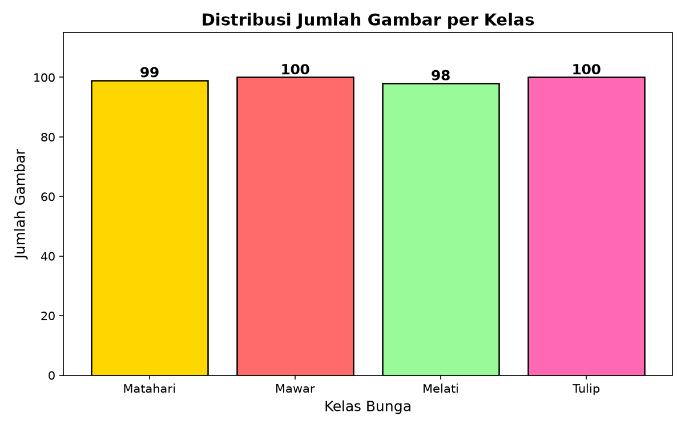
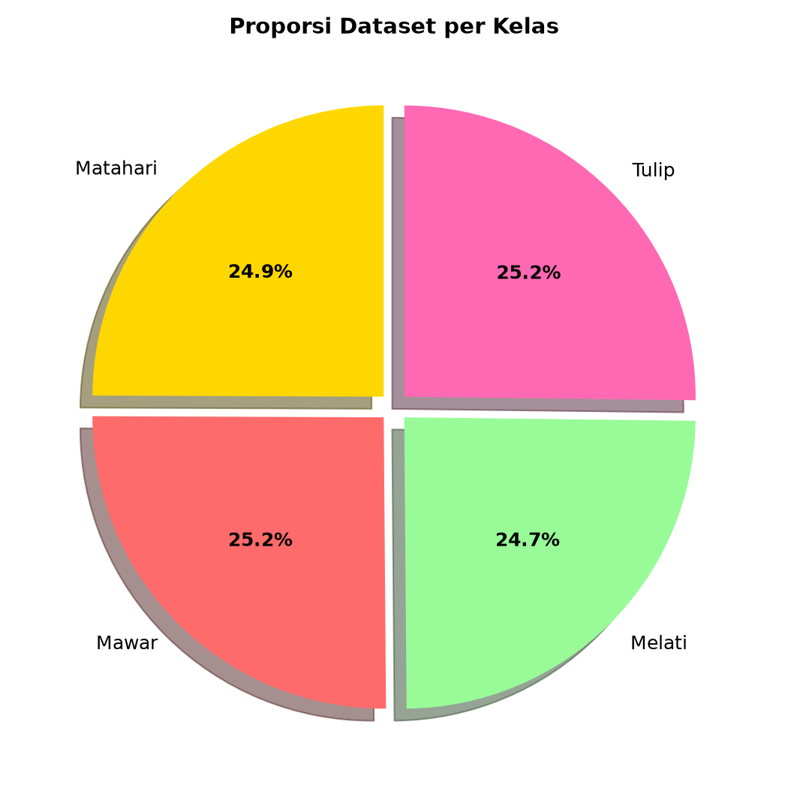
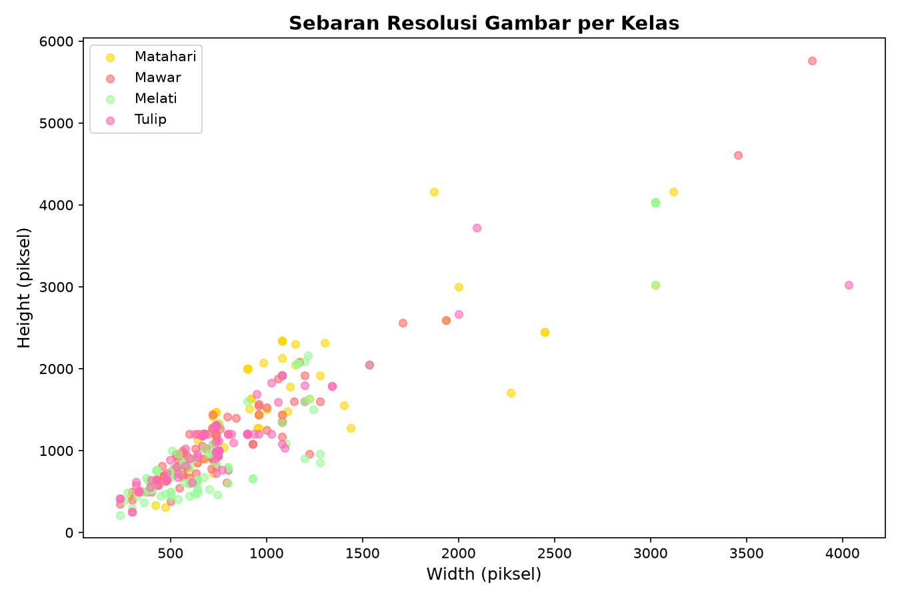
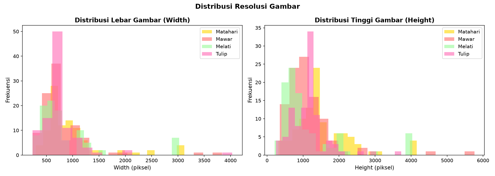
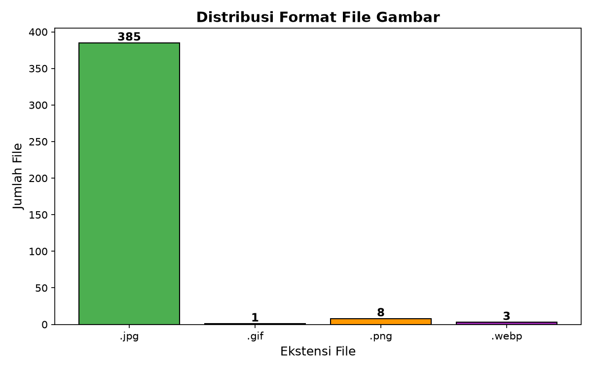
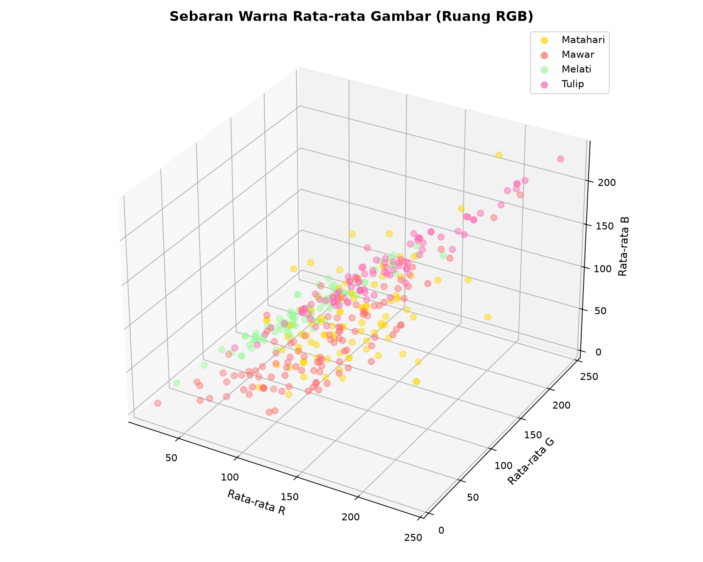
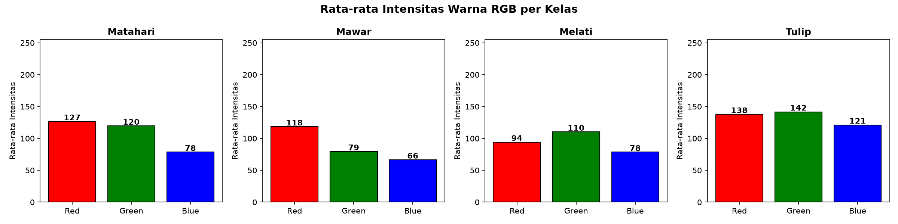
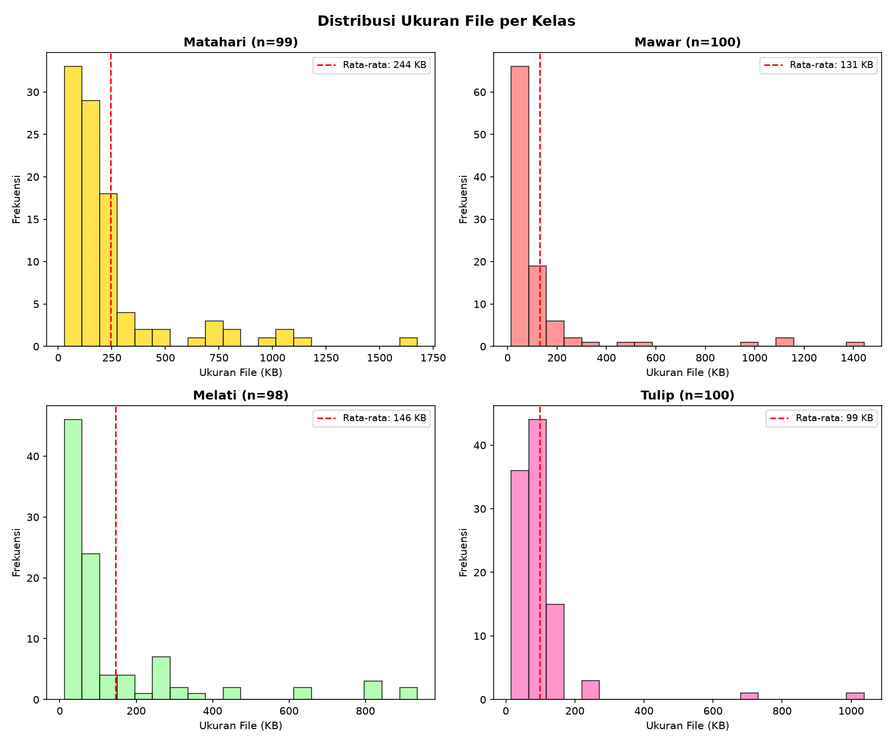
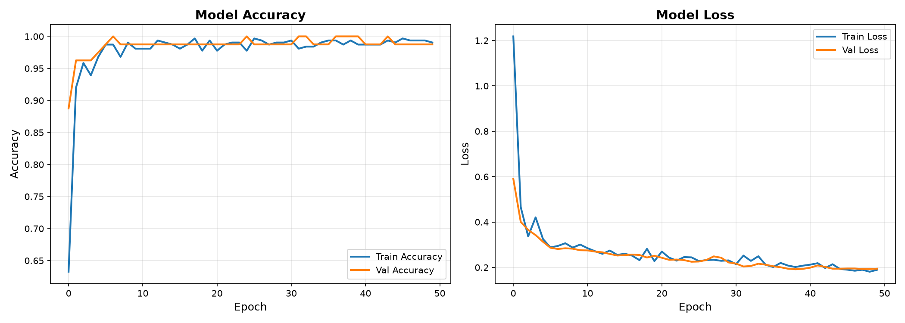
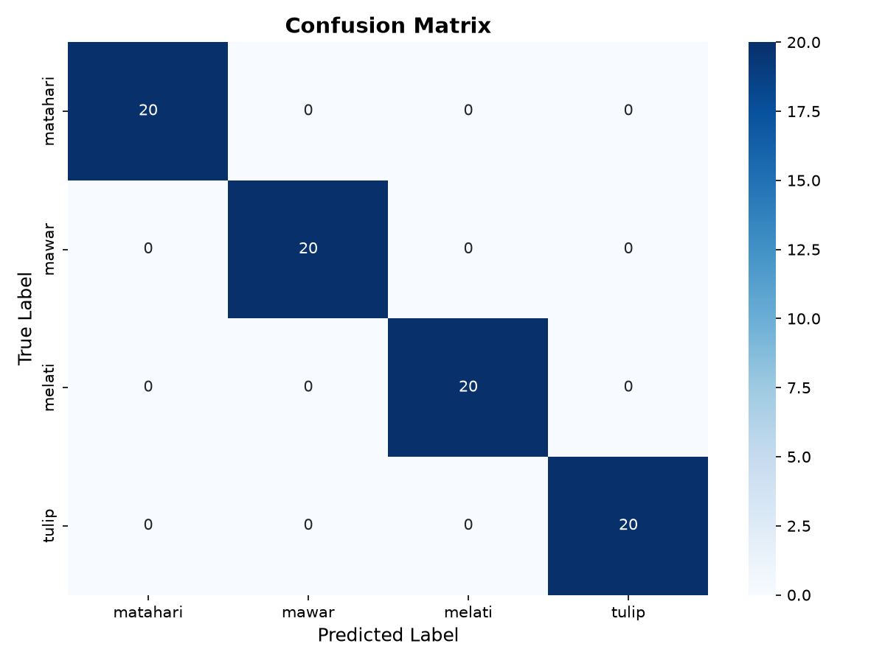

# Nama kelompok
Nabil Fawwaz S 2406079

Surya Kresna 2406089

## BAB I  PENDAHULUAN

### 1.1  Latar Belakang

Perkembangan teknologi kecerdasan buatan (Artificial Intelligence) dalam bidang computer vision telah mengalami kemajuan yang sangat pesat dalam beberapa tahun terakhir. Salah satu aplikasi yang paling signifikan adalah klasifikasi gambar, yang memungkinkan komputer untuk mengenali dan mengkategorikan objek visual secara otomatis. Di Indonesia, keanekaragaman hayati yang melimpah, termasuk ribuan spesies bunga, menciptakan kebutuhan akan sistem identifikasi otomatis yang dapat membantu berbagai pihak dalam mengenali jenis-jenis bunga.

Deep learning, khususnya Convolutional Neural Network (CNN), telah menjadi standar de facto dalam tugas klasifikasi gambar sejak keberhasilan AlexNet pada tahun 2012 (Krizhevsky et al., 2012). Arsitektur seperti MobileNetV2 (Sandler et al., 2018) menawarkan efisiensi komputasi yang tinggi dengan memperkenalkan residual inverted bottleneck, membuatnya cocok untuk perangkat dengan sumber daya terbatas. Sementara itu, inovasi terbaru berupa Vision Transformer (ViT) yang diperkenalkan oleh Dosovitskiy et al. (2021) menunjukkan bahwa arsitektur transformer murni tanpa konvolusi dapat mencapai performa state-of-the-art dalam klasifikasi gambar dengan mengaplikasikan mekanisme self-attention pada patch-patch gambar.

Penelitian ini melakukan analisis perbandingan antara dua pendekatan arsitektur yang berbeda dalam konteks klasifikasi empat jenis bunga populer di Indonesia: Bunga Matahari (Helianthus annuus), Bunga Mawar (Rosa), Bunga Melati (Jasminum), dan Bunga Tulip (Tulipa). Perbandingan ini menjadi relevan mengingat trade-off antara efisiensi komputasi (MobileNetV2) dan akurasi potensial (ViT) yang perlu dipertimbangkan dalam implementasi sistem klasifikasi bunga di dunia nyata.

### 1.2  Judul Proyek

Terdapat dua proyek yang dianalisis dalam laporan ini, yaitu:

- **Proyek 1:** "TB AI Flowers" — Implementasi klasifikasi bunga menggunakan Convolutional Neural Network (CNN) dengan arsitektur MobileNetV2 berbasis framework TensorFlow/Keras.
- **Proyek 2:** "TB AIIII Flowers" — Implementasi klasifikasi bunga menggunakan Vision Transformer (ViT-Base/16) dengan pretrained weights dari ImageNet-21k berbasis framework PyTorch dan library timm.

Kedua proyek merupakan tugas besar mata kuliah Kecerdasan Buatan yang memiliki tujuan yang sama, yaitu mengklasifikasikan gambar bunga ke dalam empat kategori, namun menggunakan pendekatan arsitektur dan framework yang berbeda.

### 1.3  Business Understanding

#### 1.3.1  Permasalahan Dunia Nyata

Identifikasi jenis bunga secara manual memerlukan pengetahuan botani yang mendalam dan seringkali memakan waktu yang tidak sedikit. Beberapa permasalahan dunia nyata yang dapat diselesaikan dengan sistem klasifikasi bunga otomatis antara lain:

- **Kesulitan Masyarakat Umum:** Banyak orang yang kesulitan mengidentifikasi jenis bunga yang mereka temui di lingkungan sekitar karena keterbatasan pengetahuan botani.
- **Keterbatasan Tenaga Ahli:** Jumlah ahli botani dan taksonomi tumbuhan sangat terbatas, sementara kebutuhan identifikasi spesies sangat tinggi, terutama dalam kegiatan konservasi dan inventarisasi keanekaragaman hayati.
- **Inefisiensi Proses Manual:** Proses identifikasi manual menggunakan buku panduan (flora) atau konsultasi dengan ahli membutuhkan waktu yang lama dan tidak praktis untuk identifikasi dalam skala besar.
- **Kebutuhan Edukasi:** Institusi pendidikan membutuhkan alat bantu interaktif untuk pembelajaran botani dan keanekaragaman hayati yang dapat menarik minat siswa.

#### 1.3.2  Tujuan Proyek

Tujuan dari proyek ini adalah:

1. Membangun model deep learning yang mampu mengklasifikasikan gambar bunga ke dalam empat kategori (Matahari, Mawar, Melati, Tulip) dengan akurasi tinggi.
2. Membandingkan performa dan efisiensi antara arsitektur CNN (MobileNetV2) dengan arsitektur Transformer (ViT-Base) dalam konteks dataset berskala kecil (±400 gambar).
3. Mengimplementasikan sistem berbasis web menggunakan Streamlit yang memungkinkan pengguna melakukan klasifikasi bunga secara interaktif melalui antarmuka yang intuitif.
4. Menganalisis trade-off antara akurasi, kecepatan inferensi, dan kebutuhan komputasi dari masing-masing arsitektur untuk memberikan rekomendasi implementasi yang sesuai dengan kebutuhan pengguna.

#### 1.3.3  Pengguna Sistem

Sistem klasifikasi bunga ini ditujukan untuk beberapa kategori pengguna:

- **Masyarakat Umum:** Individu yang ingin mengidentifikasi jenis bunga yang mereka temui untuk keperluan pribadi, hobi, atau edukasi.
- **Pelajar dan Mahasiswa:** Siswa dan mahasiswa biologi, pertanian, atau ilmu lingkungan yang membutuhkan alat bantu pembelajaran interaktif untuk mengenali jenis-jenis bunga.
- **Peneliti dan Ahli Botani:** Profesional yang membutuhkan alat bantu cepat untuk identifikasi awal spesimen bunga di lapangan.
- **Pecinta Tanaman Hias:** Komunitas tanaman hias yang sering berbagi informasi dan membutuhkan identifikasi jenis bunga untuk keperluan perawatan dan budidaya.
- **Pelaku E-commerce Tanaman:** Pedagang tanaman hias online yang ingin menyediakan fitur pencarian berbasis gambar pada platform mereka.

#### 1.3.4  Solusi dan Manfaat Implementasi AI

Solusi yang ditawarkan adalah sistem klasifikasi gambar berbasis deep learning yang dapat mengenali jenis bunga secara otomatis hanya dengan mengunggah foto. Sistem ini dibangun menggunakan dua pendekatan arsitektur yang berbeda untuk memberikan fleksibilitas dalam implementasi.

Manfaat implementasi AI dalam konteks ini meliputi:

- **Efisiensi Waktu:** Proses identifikasi yang semula memakan waktu menit hingga jam dapat dilakukan dalam hitungan detik.
- **Aksesibilitas:** Sistem dapat diakses oleh siapa saja melalui platform web tanpa memerlukan pengetahuan botani khusus.
- **Edukasi Interaktif:** Menyediakan media pembelajaran yang menarik dan interaktif untuk mengenal keanekaragaman hayati bunga.
- **Dokumentasi Otomatis:** Memungkinkan dokumentasi dan katalogisasi spesies bunga secara cepat untuk keperluan penelitian dan konservasi.
- **Skalabilitas:** Sistem dapat dengan mudah diperluas untuk mengenali jenis bunga atau tanaman lainnya dengan menambahkan data pelatihan baru.

---

## BAB II  PEMBAHASAN

### 2.1  Data Understanding

#### 2.1.1  Sumber Data

Dataset yang digunakan dalam kedua proyek bersumber dari platform Kaggle, sebuah platform kompetisi data science dan repository dataset terkemuka. Dataset "Flower Recognition" yang tersedia di Kaggle menyediakan koleksi gambar bunga yang telah dikategorikan ke dalam beberapa kelas. Untuk keperluan proyek ini, diambil empat kategori bunga yang relevan dengan konteks Indonesia: Bunga Matahari, Bunga Mawar, Bunga Melati, dan Bunga Tulip. Dataset ini dipilih karena representatif untuk tugas klasifikasi bunga dengan kompleksitas yang cukup menantang namun masih dalam batas yang dapat dikelola untuk proyek tugas besar.

#### 2.1.2  Deskripsi Fitur (Atribut)

Dataset ini merupakan data gambar (image data), bukan data tabular. Oleh karena itu, fitur-fitur yang ada merupakan nilai piksel dari gambar. Setiap gambar direpresentasikan sebagai matriks tiga dimensi dengan dimensi Height x Width x Channel, di mana channel terdiri dari Red (R), Green (G), dan Blue (B). Berikut adalah deskripsi fitur pada dataset:

| Fitur / Atribut | Deskripsi | Tipe Data |
|-----------------|-----------|-----------|
| Nilai Piksel R | Intensitas warna merah (0-255) untuk setiap piksel | Numerik (integer) |
| Nilai Piksel G | Intensitas warna hijau (0-255) untuk setiap piksel | Numerik (integer) |
| Nilai Piksel B | Intensitas warna biru (0-255) untuk setiap piksel | Numerik (integer) |
| Width | Lebar gambar dalam satuan piksel | Numerik (integer) |
| Height | Tinggi gambar dalam satuan piksel | Numerik (integer) |
| Ukuran File | Ukuran file gambar dalam kilobyte (KB) | Numerik (float) |
| Format File | Ekstensi file (.jpg, .png, .webp, .gif) | Kategorik |
| Label / Kelas | Jenis bunga (target klasifikasi) | Kategorik (multinomial) |

Jumlah total fitur (dimensi) per gambar bervariasi tergantung resolusi. Misalnya, gambar dengan resolusi 150x150 piksel akan memiliki matriks berukuran 150x150x3 = 67.500 nilai piksel sebagai fitur. Untuk gambar 224x224 piksel, jumlah fitur mencapai 150.528 nilai piksel.

#### 2.1.3  Ukuran dan Format Data

Dataset terdiri dari total 397 gambar yang tersebar dalam empat kelas. Berikut adalah rincian ukuran dan format data:

| Kelas | Jumlah File | Format Dominan | Range Resolusi | Range Ukuran File |
|-------|-------------|----------------|----------------|-------------------|
| Bunga Matahari | 99 | .jpg (97,9%) | 298x313 - 3120x4160 | 27,8 KB - 1.675,8 KB |
| Bunga Mawar | 100 | .jpg (95%) | 236x353 - 3840x5760 | 14,6 KB - 1.443,3 KB |
| Bunga Melati | 98 | .jpg (94,9%) | 239x211 - 3024x4032 | 11,7 KB - 935,7 KB |
| Bunga Tulip | 100 | .jpg (100%) | 236x250 - 4032x3724 | 15,5 KB - 1.037,8 KB |
| **Total** | **397** | **.jpg (96,9%)** | **236x211 - 3840x5760** | **11,7 KB - 1.675,8 KB** |

Mayoritas gambar (96,9%) berformat JPEG (.jpg). Format lain yang ditemukan adalah PNG (3 file), WebP (3 file), dan GIF (1 file). Seluruh gambar memiliki mode warna RGB (3 channel) dengan beberapa file PNG memiliki channel alpha (RGBA). Satu file GIF menggunakan mode palette (P) dan memerlukan konversi khusus saat preprocessing.

#### 2.1.4  Tipe Data dan Target Klasifikasi

Data yang digunakan adalah data gambar digital (unstructured data) dengan tipe data numerik untuk nilai piksel (integer 0-255). Target klasifikasi bersifat multinomial kategorik dengan empat kelas:

| Target Kelas | Label Encoding | Jumlah Sampel | Deskripsi |
|--------------|----------------|---------------|-----------|
| Bunga Matahari (Matahari) | 0 | 99 | Bunga berwarna kuning cerah dengan kelopak besar |
| Bunga Mawar (Mawar) | 1 | 100 | Bunga dengan mahkota berlapis, dominan merah/pink |
| Bunga Melati (Melati) | 2 | 98 | Bunga kecil berwarna putih dengan aroma khas |
| Bunga Tulip (Tulip) | 3 | 100 | Bunga dengan bentuk mahkota seperti cangkir |

Klasifikasi dilakukan secara multiclass, di mana setiap gambar hanya memiliki satu label kelas (mutually exclusive). Output model berupa probabilitas untuk masing-masing kelas yang dihasilkan oleh fungsi aktivasi Softmax pada layer output.

### 2.2  Exploratory Data Analysis (EDA)

Exploratory Data Analysis (EDA) dilakukan untuk memahami karakteristik dataset sebelum proses pemodelan. Analisis mencakup distribusi data, karakteristik gambar, dan pola-pola awal yang dapat mempengaruhi performa model.

Berikut adalah contoh gambar dari masing-masing kelas dalam dataset:

| Bunga Matahari | Bunga Mawar | Bunga Melati | Bunga Tulip |
|:---:|:---:|:---:|:---:|
|  |  |  |  |

#### 2.2.1  Distribusi Data

Visualisasi distribusi jumlah gambar per kelas ditunjukkan pada Gambar 1 dan Gambar 2 berikut. Dari bar chart dan pie chart terlihat bahwa distribusi data relatif seimbang antar keempat kelas.



**Gambar 1.** Distribusi Jumlah Gambar per Kelas (Bar Chart)



**Gambar 2.** Proporsi Dataset per Kelas (Pie Chart)

Distribusi data menunjukkan bahwa keempat kelas memiliki jumlah gambar yang hampir sama, yaitu berkisar antara 98 hingga 100 gambar per kelas. Selisih maksimal antar kelas hanya 2 gambar (sekitar 2% dari total), yang berarti dataset ini tidak mengalami masalah ketidakseimbangan kelas (class imbalance) yang signifikan.

#### 2.2.2  Analisis Resolusi dan Format Gambar

Analisis resolusi gambar menunjukkan variasi yang sangat tinggi, mulai dari 236x211 piksel hingga 3840x5760 piksel. Sebaran resolusi per kelas ditunjukkan pada Gambar 3 dan 4.



**Gambar 3.** Sebaran Resolusi Gambar per Kelas



**Gambar 4.** Distribusi Lebar dan Tinggi Gambar

Dari scatter plot terlihat bahwa resolusi gambar sangat bervariasi dan tidak terkonsentrasi pada ukuran tertentu. Hal ini menandakan bahwa dataset dikumpulkan dari berbagai sumber dengan kualitas kamera yang berbeda-beda. Variasi resolusi yang tinggi ini menjadi tantangan tersendiri karena model deep learning membutuhkan ukuran input yang seragam, sehingga proses resizing menjadi langkah preprocessing yang krusial.

Distribusi format file (Gambar 5) menunjukkan dominasi format JPEG yang mencakup 96,9% dari total dataset. Format PNG, WebP, dan GIF hanya menyumbang sebagian kecil dan perlu di-handle secara khusus pada tahap preprocessing.



**Gambar 5.** Distribusi Format File Gambar

#### 2.2.3  Analisis Warna

Analisis warna dilakukan dengan menghitung rata-rata intensitas RGB untuk setiap gambar. Hasil visualisasi pada Gambar 6 dan 7 menunjukkan perbedaan karakteristik warna antar kelas.



**Gambar 6.** Sebaran Warna Rata-rata dalam Ruang RGB



**Gambar 7.** Rata-rata Intensitas RGB per Kelas

Dari scatter plot 3D warna rata-rata (Gambar 6) dan bar chart perbandingan RGB (Gambar 7), terlihat bahwa setiap kelas memiliki karakteristik warna yang berbeda:

- **Bunga Matahari** didominasi warna kuning (channel R dan G tinggi)
- **Bunga Mawar** didominasi warna merah/merah muda (channel R tinggi)
- **Bunga Melati** cenderung ke warna hijau/putih (channel G tinggi)
- **Bunga Tulip** memiliki variasi warna yang lebih beragam

Perbedaan karakteristik warna ini merupakan indikasi awal bahwa model dapat membedakan kelas berdasarkan informasi warna.

#### 2.2.4  Deteksi Ketidakseimbangan Data

Berdasarkan analisis distribusi kelas, dataset ini tergolong seimbang (balanced) dengan rasio antar kelas berkisar antara 24,7% hingga 25,2%. Tidak ditemukan indikasi ketidakseimbangan data yang signifikan. Hal ini dibuktikan dengan:

- Selisih jumlah sampel antar kelas maksimal hanya 2 gambar.
- Rasio setiap kelas terhadap total dataset berkisar antara 24,7% hingga 25,2%.
- Standar deviasi jumlah sampel antar kelas sangat kecil (0,96).

Keseimbangan ini menguntungkan karena model tidak perlu diberikan penanganan khusus seperti oversampling, undersampling, atau pemberian bobot kelas (class weighting) pada saat pelatihan.

#### 2.2.5  Insight Awal dari Pola Data

Berdasarkan EDA yang telah dilakukan, beberapa insight awal yang diperoleh adalah:

1. Dataset memiliki distribusi kelas yang seimbang sehingga tidak memerlukan teknik penanganan class imbalance.
2. Variasi resolusi gambar sangat tinggi (dari thumbnail 236x211 hingga resolusi tinggi 3840x5760), sehingga proses resizing ke ukuran standar menjadi langkah preprocessing yang sangat penting.
3. Dominasi format JPEG memudahkan preprocessing karena format ini dapat langsung diproses oleh library pengolahan citra standar (PIL, OpenCV).
4. Perbedaan karakteristik warna antar kelas cukup jelas (kuning untuk matahari, merah untuk mawar, hijau/putih untuk melati), yang mengindikasikan bahwa fitur warna akan menjadi discriminative feature yang kuat.
5. Ukuran file bervariasi dari 11,7 KB hingga 1.675,8 KB, menunjukkan kualitas gambar yang tidak seragam yang dapat mempengaruhi kemampuan generalisasi model.
6. Distribusi ukuran file (Gambar 8) menunjukkan bahwa mayoritas gambar memiliki ukuran di bawah 200 KB, dengan beberapa outlier berukuran sangat besar (>1.000 KB).



**Gambar 8.** Distribusi Ukuran File per Kelas

### 2.3  Data Preparation

Data preparation merupakan tahap penting yang mempengaruhi kualitas dan performa model. Perbedaan pendekatan data preparation antara kedua proyek disajikan dalam tabel perbandingan berikut.

#### 2.3.1  Pembersihan Data

Proses pembersihan data (data cleaning) dilakukan untuk memastikan kualitas data yang akan digunakan dalam pelatihan model. Langkah-langkah pembersihan data meliputi:

**a. Filter Format File**

- **Proyek MobileNetV2 (TF):** Hanya memproses file dengan ekstensi .jpg, .jpeg, dan .png. File .gif dan .webp secara otomatis diabaikan. Hal ini dilakukan dengan pemeriksaan ekstensi file pada saat proses splitting dataset.
- **Proyek ViT (PyTorch):** Menerima semua format gambar yang didukung oleh library PIL, termasuk .jpg, .jpeg, .png, .webp, dan .gif. File yang tidak dapat dibuka akan menimbulkan error yang perlu di-handle.

**b. Konversi Mode Warna**

Seluruh gambar dikonversi ke mode RGB untuk memastikan konsistensi jumlah channel (3 channel). Gambar RGBA (PNG dengan transparansi) dikonversi dengan membuang channel alpha. Gambar palette (mode P) dikonversi ke RGB. Proyek TensorFlow menangani ini secara otomatis melalui ImageDataGenerator, sementara proyek PyTorch menggunakan `Image.open().convert("RGB")` dalam custom Dataset class.

**c. Penanganan File Korup**

Tidak ditemukan file gambar yang korup dalam dataset. Namun, kedua proyek secara implisit menangani potensi error melalui exception handling pada saat membuka file gambar.

#### 2.3.2  Encoding Data Kategorik

Label kelas yang berbentuk kategorik (nama bunga) perlu diubah menjadi representasi numerik agar dapat diproses oleh model deep learning. Kedua proyek menggunakan pendekatan yang berbeda:

**Proyek MobileNetV2 (TensorFlow/Keras):**
- Menggunakan `ImageDataGenerator.flow_from_directory()` dari Keras yang secara otomatis melakukan label encoding berdasarkan struktur folder.
- Label dikonversi menjadi one-hot encoding (categorical) karena loss function yang digunakan adalah Categorical Crossentropy.
- Urutan kelas berdasarkan urutan alphabetical folder: matahari (0), mawar (1), melati (2), tulip (3).

**Proyek ViT (PyTorch):**
- Melakukan label encoding manual dalam custom dataset class (FlowerDataset) dengan memetakan setiap kelas ke integer index (0-3) berdasarkan urutan folder.
- Loss function CrossEntropyLoss di PyTorch menerima label dalam format integer (sparse categorical crossentropy).

#### 2.3.3  Normalisasi/Standardisasi Data Numerik

Normalisasi nilai piksel diperlukan untuk mempercepat konvergensi model dan mencegah dominasi fitur dengan skala nilai yang besar. Setiap proyek menggunakan pendekatan normalisasi yang berbeda:

| Aspek | MobileNetV2 (TF) | ViT (PyTorch) |
|-------|-----------------|---------------|
| **Metode** | Rescaling (Min-Max) | Standardisasi (Z-score) |
| **Rumus** | piksel / 255.0 | (piksel - mean) / std |
| **Range Output** | [0, 1] | [-1, 1] |
| **Mean** | 0 (implisit) | 0,5 (eksplisit) |
| **Standard Deviation** | 1 (implisit) | 0,5 (eksplisit) |
| **Implementasi** | `rescale=1./255` pada ImageDataGenerator | `Normalize(mean=[0.5,0.5,0.5], std=[0.5,0.5,0.5])` dari torchvision |
| **Resolusi Input** | 150x150 piksel | 224x224 piksel |

Normalisasi rescaling (1/255) pada TensorFlow lebih sederhana dan memetakan nilai piksel ke rentang [0, 1]. Sementara itu, standardisasi pada ViT memetakan nilai piksel ke rentang [-1, 1], yang merupakan pendekatan yang lebih umum digunakan untuk model-model pretrained dari ImageNet. Namun, perlu dicatat bahwa ViT-Base dari timm umumnya menggunakan mean dan std standar ImageNet (mean=[0.485, 0.456, 0.406], std=[0.229, 0.224, 0.225]), bukan [0.5, 0.5, 0.5] yang digunakan dalam proyek ini.

#### 2.3.4  Split Data

Pembagian dataset (data split) dilakukan dengan proporsi yang berbeda pada masing-masing proyek:

| Aspek | MobileNetV2 (TF) | ViT (PyTorch) |
|-------|-----------------|---------------|
| **Proporsi Split** | 80% Train / 20% Validation | 70% Train / 15% Val / 15% Test |
| **Jumlah Train** | 313 gambar | ±278 gambar |
| **Jumlah Validation** | 80 gambar | ±59 gambar |
| **Jumlah Test** | Tidak ada (hanya val) | ±60 gambar (test set terpisah) |
| **Metode Split** | Stratified Shuffle Split | Stratified Shuffle Split |
| **Random State** | 42 | 42 |
| **Struktur Output** | Copy ke folder dataset_split/ | In-memory split (tidak copy) |
| **Stratifikasi** | Ya (per kelas proporsional) | Ya (per kelas proporsional) |

Kedua proyek menggunakan stratified splitting untuk memastikan proporsi setiap kelas terjaga di setiap subset. Proyek TensorFlow membuat salinan fisik file ke folder `dataset_split/`, sementara proyek PyTorch melakukan split secara in-memory menggunakan Scikit-learn `train_test_split`. Perbedaan penting adalah keberadaan test set pada proyek ViT yang digunakan untuk evaluasi final model, sementara proyek MobileNetV2 hanya memiliki validation set dan mengandalkan data validation tersebut untuk evaluasi.

### 2.4  Modeling

#### 2.4.1  Pemilihan Algoritma

Pemilihan algoritma dalam proyek ini didasarkan pada dua paradigma utama dalam deep learning untuk klasifikasi gambar: Convolutional Neural Network (CNN) dan Vision Transformer (ViT).

**Algoritma 1: MobileNetV2 (CNN)**

MobileNetV2 adalah arsitektur CNN yang diperkenalkan oleh Sandler et al. (2018) dari Google. Arsitektur ini menggunakan konsep inverted residual dengan linear bottleneck dan depthwise separable convolution untuk mengurangi jumlah parameter dan komputasi secara signifikan tanpa mengorbankan akurasi secara berarti.

**Algoritma 2: Vision Transformer ViT-Base/16**

Vision Transformer (ViT) yang diperkenalkan oleh Dosovitskiy et al. (2021) merupakan arsitektur yang mengaplikasikan transformer encoder yang sukses di NLP ke bidang computer vision. Gambar dibagi menjadi patch-patch berukuran tetap (16x16 piksel), yang kemudian di-flatten dan diproses oleh transformer encoder dengan mekanisme self-attention.

#### 2.4.2  Alasan Pemilihan Algoritma

**Alasan Pemilihan MobileNetV2:**

- **Efisiensi Parameter:** Dengan hanya ±126 ribu parameter trainable (setelah transfer learning), MobileNetV2 sangat cocok untuk dataset kecil (±400 gambar) karena risiko overfitting yang lebih rendah.
- **Kecepatan Training dan Inferensi:** Arsitektur yang ringan memungkinkan training dan inference yang cepat, bahkan di CPU. Ini penting untuk deployment di perangkat dengan keterbatasan komputasi.
- **Ketersediaan Pretrained Weights:** MobileNetV2 tersedia sebagai model pretrained di Keras Applications dengan bobot ImageNet, memungkinkan transfer learning yang efektif.
- **Kemudahan Implementasi:** Integrasi yang baik dengan TensorFlow/Keras dan API yang sederhana (ImageDataGenerator, model.fit) mempercepat pengembangan.

**Alasan Pemilihan Vision Transformer ViT-Base:**

- **Kemampuan Menangkap Global Context:** Mekanisme self-attention pada ViT mampu menangkap hubungan antar patch gambar secara global, tidak terbatas oleh local receptive field seperti pada CNN.
- **Performa State-of-the-Art:** ViT telah menunjukkan performa yang sebanding atau lebih baik dibandingkan CNN pada berbagai benchmark klasifikasi gambar dengan dataset yang cukup besar.
- **Pretrained pada ImageNet-21k:** ViT-Base tersedia dengan pretrained weights dari ImageNet-21k (14 juta gambar, 21.000 kelas), memberikan representasi visual yang sangat kaya sebagai titik awal fine-tuning.
- **Inovasi Arsitektur:** Sebagai arsitektur yang relatif baru, ViT menawarkan perspektif berbeda dalam memahami gambar dan membuka peluang eksplorasi lebih lanjut.

#### 2.4.3  Implementasi Model

**Implementasi MobileNetV2 (TensorFlow/Keras)**

Berikut adalah potongan kode implementasi model MobileNetV2 pada proyek TB AI Flowers:

```python
# Load backbone MobileNetV2 (pretrained, frozen)
base_model = MobileNetV2(
    weights='imagenet',
    include_top=False,
    input_shape=(150, 150, 3)
)
base_model.trainable = False  # Freeze backbone

# Custom classification head
model = Sequential([
    base_model,
    GlobalAveragePooling2D(),
    BatchNormalization(),
    Dropout(0.3),
    Dense(128, activation='relu', kernel_regularizer=l2(0.001)),
    BatchNormalization(),
    Dropout(0.3),
    Dense(4, activation='softmax')
])

# Compile
model.compile(
    optimizer=Adam(learning_rate=0.001),
    loss='categorical_crossentropy',
    metrics=['accuracy']
)

# Callbacks
callbacks = [
    ModelCheckpoint(
        'models/flower_cnn.keras',
        monitor='val_accuracy',
        save_best_only=True
    ),
    EarlyStopping(patience=15, restore_best_weights=True),
    ReduceLROnPlateau(factor=0.5, patience=5, min_lr=1e-6)
]

# Training dengan data generator
history = model.fit(
    train_generator,
    validation_data=validation_generator,
    epochs=50,
    callbacks=callbacks
)
```

**Implementasi Vision Transformer ViT-Base (PyTorch)**

Berikut adalah potongan kode implementasi model ViT-Base pada proyek TB AIIII Flowers:

```python
# Load ViT-Base/16 dari timm (pretrained ImageNet-21k)
model = timm.create_model(
    'vit_base_patch16_224',
    pretrained=True,
    num_classes=4
)

# Optimizer, Loss, Scheduler
optimizer = torch.optim.AdamW(
    model.parameters(),
    lr=2e-5,
    weight_decay=1e-4
)
criterion = nn.CrossEntropyLoss()
scheduler = torch.optim.lr_scheduler.CosineAnnealingLR(
    optimizer, T_max=30
)

# Training loop
for epoch in range(30):
    model.train()
    for images, labels in train_loader:
        images, labels = images.to(device), labels.to(device)
        optimizer.zero_grad()
        outputs = model(images)
        loss = criterion(outputs, labels)
        loss.backward()
        optimizer.step()
    scheduler.step()

    # Early stopping
    val_acc = evaluate(model, val_loader, device)
    if val_acc > best_val_acc:
        best_val_acc = val_acc
        torch.save(model.state_dict(), 'checkpoints/best_vit.pth')
        patience_counter = 0
    else:
        patience_counter += 1
        if patience_counter >= 7:
            break
```

#### 2.4.4  Perbandingan Model

Tabel berikut menyajikan perbandingan detail antara kedua model yang diimplementasikan:

| Aspek | MobileNetV2 | ViT-Base/16 |
|-------|-------------|-------------|
| **Total Parameter** | ± 2,4 juta | ± 86 juta |
| **Trainable Parameter** | ± 126 ribu | ± 86 juta (full fine-tuning) |
| **Backbone Pretrained** | ImageNet (1K classes) | ImageNet-21K (21K classes) |
| **Transfer Learning** | Ya (backbone frozen) | Ya (full fine-tuning) |
| **Input Resolution** | 150x150 piksel | 224x224 piksel |
| **Jumlah Layer** | 53 layer (MobileNetV2) + 4 custom | 12 Transformer blocks + 1 head |
| **Mekanisme Utama** | Depthwise Separable Convolution | Multi-Head Self-Attention |
| **Optimizer** | Adam (lr=0.001) | AdamW (lr=2e-5, wd=1e-4) |
| **Loss Function** | Categorical Crossentropy | CrossEntropyLoss |
| **Batch Size** | 32 (default generator) | 16 (DataLoader) |
| **Epoch Maksimal** | 50 | 30 |
| **Regularisasi** | L2 (0.001) + Dropout (0.3-0.5) | Weight Decay (1e-4) |
| **LR Scheduler** | ReduceLROnPlateau (factor=0.5, patience=5) | CosineAnnealingLR (T_max=30) |
| **Early Stopping** | Patience=15 (val_loss) | Patience=7 (val_accuracy) |
| **Framework** | TensorFlow 2.x / Keras | PyTorch 2.x + timm |
| **Callbacks/Logging** | ModelCheckpoint + CSV Logger | TensorBoard + checkpoint .pth |

#### 2.4.5  Visualisasi Model

Visualisasi arsitektur model dapat dijelaskan secara konseptual sebagai berikut:

**Arsitektur MobileNetV2:**

MobileNetV2 terdiri dari 53 layer yang tersusun dalam 17 inverted residual blocks. Setiap block memiliki struktur bottleneck: ekspansi (1x1 conv) -> depthwise conv (3x3) -> proyeksi (1x1 conv) dengan residual connection. Input gambar 150x150x3 diproses melalui initial convolution 32 filter, kemudian 7 bottleneck blocks dengan stride untuk downsampling, diikuti 7 bottleneck blocks dengan stride 1 untuk feature extraction lebih dalam. Output akhir berupa feature map 7x7x1280 yang kemudian dilanjutkan ke custom classification head.

**Arsitektur Vision Transformer ViT-Base/16:**

ViT-Base memproses gambar 224x224 dengan membaginya menjadi 196 patch (16x16 piksel). Setiap patch di-flatten dan diproyeksikan ke embedding 768 dimensi (patch embedding). Ditambahkan position embedding untuk mempertahankan informasi posisi spasial. Sebuah [CLS] token ditambahkan untuk tugas klasifikasi. Ke-197 token (196 patch + 1 [CLS]) diproses oleh 12 transformer encoder blocks, masing-masing terdiri dari: LayerNorm -> Multi-Head Self-Attention (12 heads) -> Residual -> LayerNorm -> MLP (2 layer: Dense 3072 -> GELU -> Dense 768) -> Residual. Output [CLS] token dari layer terakhir digunakan sebagai representasi gambar dan dilanjutkan ke classification head (LayerNorm -> Linear 768x4).

### 2.5  Evaluation

Evaluasi model dilakukan menggunakan metrik-metrik standar dalam klasifikasi multiclass, yaitu akurasi, precision, recall, dan F1-score. Selain itu, dihasilkan juga confusion matrix untuk visualisasi performa per kelas.

**Hasil Evaluasi Model**

| Metrik | MobileNetV2 | ViT-Base/16 |
|--------|-------------|-------------|
| **Akurasi** | Tidak tercatat secara numerik (validation) | 100% (test set, 61 sampel) |
| **Precision (Weighted)** | Tidak tercatat secara numerik | 1.00 |
| **Recall (Weighted)** | Tidak tercatat secara numerik | 1.00 |
| **F1-Score (Weighted)** | Tidak tercatat secara numerik | 1.00 |
| **Jumlah Epoch Aktual** | Tergantung early stopping | 8 epoch (dari 30 maksimal) |
| **Waktu Training** | Tidak tercatat | ± 16,5 menit |
| **Waktu per Epoch** | Tidak tercatat | ± 123 detik |
| **Test Set Size** | Tidak ada test set terpisah | 61 sampel |

**Visualisasi Training dan Evaluasi Model MobileNetV2 (TB AI Flowers)**

Berikut adalah grafik training history yang menunjukkan akurasi dan loss selama proses pelatihan model MobileNetV2:



**Gambar 9.** Training History Model MobileNetV2

Berikut adalah confusion matrix hasil evaluasi model MobileNetV2 pada data validasi:



**Gambar 10.** Confusion Matrix Model MobileNetV2

Model ViT-Base mencapai akurasi sempurna (100%) pada test set dengan 61 sampel yang terdiri dari ±15 sampel per kelas. Model mencapai konvergensi dengan sangat cepat: akurasi validasi sudah mencapai 100% pada epoch pertama dan training berhenti di epoch 8 karena early stopping (patience=7). Classification report menunjukkan nilai precision, recall, dan F1-score sempurna (1.00) untuk seluruh kelas.

Untuk model MobileNetV2, dari grafik training history yang dihasilkan, terlihat bahwa model mencapai akurasi validasi yang baik dengan overfitting yang terkendali berkat regularisasi L2 dan dropout yang diterapkan pada classification head.

**Analisis Perbandingan Evaluasi:**

Perbandingan evaluasi menunjukkan bahwa ViT-Base unggul dalam hal akurasi dengan mencapai 100% pada test set. Namun, hasil ini perlu diinterpretasikan secara hati-hati mengingat ukuran test set yang relatif kecil (61 sampel). Beberapa faktor yang perlu dipertimbangkan:

1. **Ukuran Dataset:** Dengan hanya ±400 gambar total, dataset ini sangat kecil untuk melatih model ViT dengan 86 juta parameter. Risiko overfitting sangat tinggi meskipun hasil test menunjukkan akurasi sempurna.
2. **Kompleksitas Model:** ViT-Base memiliki rasio parameter per sampel yang sangat besar (86 juta / 397 ≈ 216.000 parameter per sampel), yang secara teoritis sangat rentan terhadap overfitting.
3. **Kemudahan Dataset:** Dataset dengan 4 kelas dan perbedaan visual yang cukup jelas (warna, bentuk) mungkin terlalu sederhana untuk mengukur perbedaan kemampuan antara CNN dan ViT secara bermakna.
4. **Validasi Silang:** Tidak dilakukannya k-fold cross validation membuat hasil evaluasi mungkin tidak sepenuhnya representatif terhadap performa model secara umum.

### 2.6  Perbandingan Implementasi Aplikasi

Kedua proyek diintegrasikan ke dalam aplikasi web berbasis Streamlit yang memungkinkan pengguna melakukan klasifikasi bunga secara interaktif. Berikut adalah perbandingan implementasi aplikasi:

| Fitur | TB AI Flowers (MobileNetV2) | TB AIIII Flowers (ViT) |
|-------|-----------------------------|------------------------|
| **Framework UI** | Streamlit | Streamlit |
| **Input Gambar** | Upload file + Sample images | Upload file + Sample images |
| **Jumlah Sampel** | 12 gambar sampel dari dataset | 12 gambar sampel dari dataset |
| **Output Prediksi** | Nama kelas + confidence + bar chart | Nama kelas + confidence + bar chart |
| **Tab Informasi** | Arsitektur, Dataset, Hyperparameter | Arsitektur, Dataset, Hyperparameter |
| **Penanganan Upload** | Simpan ke temp, prediksi, hapus | Simpan ke temp, prediksi, hapus |
| **Loading Model** | Singleton pattern (load_model_once) | Singleton pattern (lazy load) |
| **Custom CSS** | Ya (gradient header, cards) | Ya (gradient header, cards) |
| **Peringatan** | Jika model tidak ditemukan | Jika model tidak ditemukan |

Kedua aplikasi memiliki antarmuka dan fungsionalitas yang sangat mirip, menunjukkan bahwa perbedaan arsitektur model tidak mempengaruhi pengalaman pengguna secara signifikan pada sisi frontend. Keduanya menyediakan dua metode input (unggah file dan memilih gambar sampel) serta menampilkan hasil prediksi dalam format yang mudah dipahami (nama kelas, confidence score, dan bar chart probabilitas per kelas).

---

## BAB III  PENUTUP

### 3.1  Kesimpulan

Berdasarkan analisis perbandingan yang telah dilakukan terhadap dua proyek klasifikasi bunga menggunakan deep learning, dapat ditarik kesimpulan sebagai berikut:

1. Kedua proyek berhasil mengimplementasikan model deep learning untuk klasifikasi empat jenis bunga (Bunga Matahari, Bunga Mawar, Bunga Melati, dan Bunga Tulip) dengan hasil yang sangat baik. Keduanya dilengkapi dengan antarmuka web berbasis Streamlit yang memungkinkan pengguna melakukan klasifikasi secara interaktif.

2. Model Vision Transformer (ViT-Base/16) mencapai akurasi sempurna (100%) pada test set dengan 61 sampel, mengungguli MobileNetV2 dalam hal akurasi. Namun, hasil ini perlu divalidasi lebih lanjut dengan dataset yang lebih besar dan beragam mengingat potensi overfitting akibat rasio parameter yang sangat besar terhadap jumlah data.

3. MobileNetV2 menawarkan efisiensi komputasi yang jauh lebih baik dengan hanya 126 ribu parameter trainable (berbanding 86 juta pada ViT), menjadikannya pilihan yang lebih tepat untuk deployment pada perangkat dengan sumber daya terbatas (mobile devices, edge computing) dan untuk aplikasi yang memerlukan respons waktu nyata (real-time).

4. Distribusi dataset yang seimbang (98-100 gambar per kelas) dan karakteristik visual yang cukup berbeda antar kelas menjadi faktor yang memudahkan model dalam melakukan klasifikasi. Variasi resolusi dan kualitas gambar yang tinggi merupakan tantangan yang berhasil diatasi melalui preprocessing dan augmentasi data.

5. Pendekatan transfer learning terbukti efektif untuk kedua arsitektur, memungkinkan model mencapai performa tinggi meskipun dengan jumlah data pelatihan yang terbatas. Pretrained weights dari ImageNet memberikan initial representation yang kuat untuk tugas klasifikasi bunga.

6. Perbedaan framework (TensorFlow vs PyTorch) tidak secara signifikan mempengaruhi performa akhir model, namun mempengaruhi kemudahan implementasi dan ketersediaan tools. TensorFlow/Keras menawarkan API yang lebih high-level dan intuitif untuk pemula, sementara PyTorch memberikan fleksibilitas yang lebih besar untuk eksperimen dan riset.

### 3.2  Rekomendasi

Berdasarkan temuan dan analisis yang telah dilakukan, berikut adalah rekomendasi untuk pengembangan selanjutnya:

1. **Memperbesar Ukuran Dataset:** Mengumpulkan minimal 500-1000 gambar per kelas untuk menguji generalisasi model secara lebih akurat. Dataset yang lebih besar juga akan memungkinkan evaluasi yang lebih bermakna antara arsitektur CNN dan ViT.

2. **Eksperimen dengan Varian Model Lain:** Mencoba varian ViT yang lebih ringan (ViT-Tiny, ViT-Small) atau arsitektur CNN modern lainnya (EfficientNet, ConvNeXt) untuk menemukan keseimbangan optimal antara akurasi dan efisiensi.

3. **K-Fold Cross Validation:** Menerapkan k-fold cross validation (minimal 5-fold) untuk mendapatkan estimasi performa yang lebih robust dan mengurangi pengaruh variasi split data terhadap hasil evaluasi.

4. **Hyperparameter Tuning Sistematis:** Melakukan hyperparameter tuning menggunakan tools seperti Optuna, Hyperopt, atau GridSearchCV untuk mengoptimalkan learning rate, batch size, jumlah epoch, dan parameter regularisasi pada kedua arsitektur.

5. **Pengujian pada Data Dunia Nyata:** Menguji model pada foto-foto bunga yang diambil langsung dari lapangan dengan berbagai kondisi pencahayaan, sudut pengambilan, dan latar belakang untuk memvalidasi kemampuan generalisasi model.

6. **Analisis Trade-off yang Lebih Komprehensif:** Menambahkan metrik evaluasi tambahan seperti inference time (CPU dan GPU), model size (disk dan memory), dan energy consumption untuk analisis trade-off yang lebih lengkap.

7. **Ekspansi ke Kelas Lain:** Memperluas sistem untuk mengenali lebih banyak jenis bunga atau tanaman, baik yang umum ditemukan di Indonesia maupun spesies internasional, untuk meningkatkan utilitas aplikasi.

8. **Integrasi dengan Aplikasi Mobile:** Mengembangkan versi mobile application (Android/iOS) menggunakan TensorFlow Lite atau ONNX Runtime untuk memudahkan akses pengguna di lapangan tanpa memerlukan koneksi internet.

---

## REFERENSI

[1] Dosovitskiy, A., Beyer, L., Kolesnikov, A., Weissenborn, D., Zhai, X., Unterthiner, T., ... & Houlsby, N. (2021). An Image is Worth 16x16 Words: Transformers for Image Recognition at Scale. In *International Conference on Learning Representations (ICLR)*.

[2] Sandler, M., Howard, A., Zhu, M., Zhmoginov, A., & Chen, L. C. (2018). MobileNetV2: Inverted Residuals and Linear Bottlenecks. In *Proceedings of the IEEE Conference on Computer Vision and Pattern Recognition (CVPR)* (pp. 4510-4520).

[3] Howard, A. G., Zhu, M., Chen, B., Kalenichenko, D., Wang, W., Weyand, T., ... & Adam, H. (2017). MobileNets: Efficient Convolutional Neural Networks for Mobile Vision Applications. *arXiv preprint arXiv:1704.04861*.

[4] Krizhevsky, A., Sutskever, I., & Hinton, G. E. (2012). ImageNet Classification with Deep Convolutional Neural Networks. In *Advances in Neural Information Processing Systems (NeurIPS)* (pp. 1097-1105).

[5] He, K., Zhang, X., Ren, S., & Sun, J. (2016). Deep Residual Learning for Image Recognition. In *Proceedings of the IEEE Conference on Computer Vision and Pattern Recognition (CVPR)* (pp. 770-778).
